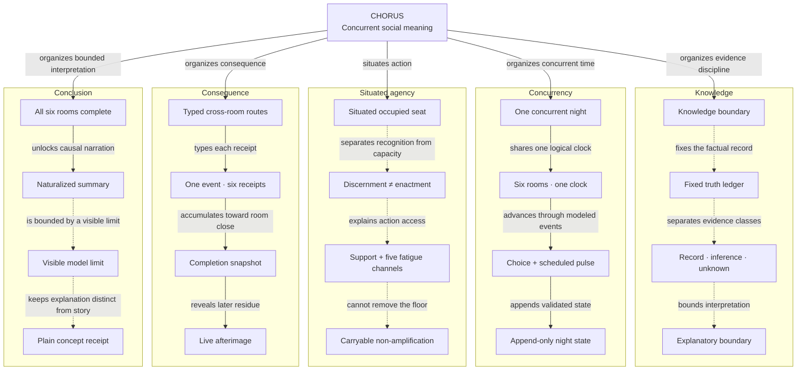

# CHORUS concept map

This map makes CHORUS's knowledge, concurrency, situated agency, consequence, and conclusion architecture readable as one typed system. The visual is supplementary: the concept register and relationship table below are the canonical text equivalent.

[Open the interactive HTML edition](chorus-concept-map.html) · [Download the machine-readable register](discovery-atlas.json)

## Authority and claim boundary

Repository certainties are bounded to cited implementation, automated evidence, or explicit product boundaries. They are not claims of external validity, user comprehension, prediction, diagnosis, or universal accessibility.

A classification changes only in this register, with a dated history entry and cited evidence. Filtering, selecting, expanding, or exporting a rendered view never changes authoritative state.

## Map

The diagram renders the primary, crossing-free structure. Cross-domain relations remain explicit in the complete relationship table rather than being routed through unrelated nodes.

## Concept register

### Knowledge

What the work fixes, exposes, separates, and leaves unresolved.

<strong>CHR-MAP-N-001</strong> · Knowledge boundary — Evidence before interpretation

The work keeps what happened, what circulated, what an audience inferred, what a fictional seat protects, and what remains unresolved in separately governed records.

- **Authority:** Communication and fatigue atlas
- **Sources:** [Communication and fatigue atlas](https://github.com/howardhayden/chorus/blob/main/docs/COMMUNICATION-ATLAS.md) (`docs/COMMUNICATION-ATLAS.md`); [Thesis and ethical argument](https://github.com/howardhayden/chorus/blob/main/docs/THESIS-AND-ETHICS.md) (`docs/THESIS-AND-ETHICS.md`)
- **Typed relations:** CHORUS → organizes evidence discipline (CHR-MAP-E-001); fixes the factual record → Fixed truth ledger (CHR-MAP-E-006)

<strong>CHR-MAP-N-002</strong> · Fixed truth ledger — Incident facts do not move

Known fact, unresolved-at-entry boundary, and later resolution are fixed by generation and excluded from propagation coefficients and player-state mutation.

- **Authority:** Scenario grammar and coherence gates
- **Sources:** [Generation and coherence](https://github.com/howardhayden/chorus/blob/main/docs/GENERATION-COHERENCE.md) (`docs/GENERATION-COHERENCE.md`); [Architecture](https://github.com/howardhayden/chorus/blob/main/docs/ARCHITECTURE.md) (`docs/ARCHITECTURE.md`); [Concurrent-night executable contract](https://github.com/howardhayden/chorus/blob/main/tests/concurrent-night.test.mjs) (`tests/concurrent-night.test.mjs`)
- **Typed relations:** Knowledge boundary → fixes the factual record (CHR-MAP-E-006); separates evidence classes → Record · inference · unknown (CHR-MAP-E-007); supplies incident resolution without yielding truth to reach → Naturalized summary (CHR-MAP-E-025)

<strong>CHR-MAP-N-003</strong> · Record · inference · unknown — Different authority, different burden

Observed conduct, audience interpretation, authored interior, and unresolved questions remain distinguishable; none silently upgrades another into fact.

- **Authority:** Communication ledger and disclosure contract
- **Sources:** [Communication and fatigue atlas](https://github.com/howardhayden/chorus/blob/main/docs/COMMUNICATION-ATLAS.md) (`docs/COMMUNICATION-ATLAS.md`); [Interaction and progressive disclosure](https://github.com/howardhayden/chorus/blob/main/docs/INTERACTION-DISCLOSURE.md) (`docs/INTERACTION-DISCLOSURE.md`)
- **Typed relations:** Fixed truth ledger → separates evidence classes (CHR-MAP-E-007); bounds interpretation → Explanatory boundary (CHR-MAP-E-008)

<strong>CHR-MAP-N-004</strong> · Explanatory boundary — Not diagnosis or prediction

The represented mechanisms explain a synthetic night. They do not infer real motive, rank trustworthiness, diagnose people, or predict real-world frequency.

- **Authority:** Thesis, ethics, and limitations
- **Sources:** [Thesis and ethical argument](https://github.com/howardhayden/chorus/blob/main/docs/THESIS-AND-ETHICS.md) (`docs/THESIS-AND-ETHICS.md`); [Limitations](https://github.com/howardhayden/chorus/blob/main/docs/LIMITATIONS.md) (`docs/LIMITATIONS.md`)
- **Typed relations:** Record · inference · unknown → bounds interpretation (CHR-MAP-E-008); governs the public claim boundary → Visible model limit (CHR-MAP-E-027)

### Concurrency

How six rooms share one logical night without penalizing reading or navigation.

<strong>CHR-MAP-N-005</strong> · One concurrent night — Externalities remain in view

Six incidents remain active together so a locally understandable action can change what another room can notice, verify, attribute, or carry.

- **Authority:** Product thesis and concurrent runtime
- **Sources:** [Thesis and ethical argument](https://github.com/howardhayden/chorus/blob/main/docs/THESIS-AND-ETHICS.md) (`docs/THESIS-AND-ETHICS.md`); [Concurrent-night runtime](https://github.com/howardhayden/chorus/blob/main/docs/CONCURRENT-NIGHT.md) (`docs/CONCURRENT-NIGHT.md`)
- **Typed relations:** CHORUS → organizes concurrent time (CHR-MAP-E-002); shares one logical clock → Six rooms · one clock (CHR-MAP-E-009)

<strong>CHR-MAP-N-006</strong> · Six rooms · one clock — Entry does not create the room

Every room exists from minute zero. Navigation changes the occupied view, while accepted actions and explicit clock movement advance modeled time.

- **Authority:** Concurrent-night runtime
- **Sources:** [Concurrent-night runtime](https://github.com/howardhayden/chorus/blob/main/docs/CONCURRENT-NIGHT.md) (`docs/CONCURRENT-NIGHT.md`); [Interaction and progressive disclosure](https://github.com/howardhayden/chorus/blob/main/docs/INTERACTION-DISCLOSURE.md) (`docs/INTERACTION-DISCLOSURE.md`)
- **Typed relations:** One concurrent night → shares one logical clock (CHR-MAP-E-009); advances through modeled events → Choice + scheduled pulse (CHR-MAP-E-010)

<strong>CHR-MAP-N-007</strong> · Choice + scheduled pulse — Only modeled events advance state

Accepted choices and due autonomous pulses are the causal inputs. Reading speed, focus, room inspection, and assistive technology do not become events.

- **Authority:** Reducer and scheduling contracts
- **Sources:** [Concurrent-night runtime](https://github.com/howardhayden/chorus/blob/main/docs/CONCURRENT-NIGHT.md) (`docs/CONCURRENT-NIGHT.md`); [Accessibility](https://github.com/howardhayden/chorus/blob/main/docs/ACCESSIBILITY.md) (`docs/ACCESSIBILITY.md`); [Concurrent-night executable contract](https://github.com/howardhayden/chorus/blob/main/tests/concurrent-night.test.mjs) (`tests/concurrent-night.test.mjs`)
- **Typed relations:** Six rooms · one clock → advances through modeled events (CHR-MAP-E-010); appends validated state → Append-only night state (CHR-MAP-E-011); produces one event with six receipts → One event · six receipts (CHR-MAP-E-021); Support + five fatigue channels → conditions which choice is carryable (CHR-MAP-E-022); Carryable non-amplification → guarantees a non-amplifying input (CHR-MAP-E-023)

<strong>CHR-MAP-N-008</strong> · Append-only night state — Replay checks the causal record

Accepted decisions, pulse identities, and effects accumulate in one validated state that can be deterministically replayed from the seed and ordered action record.

- **Authority:** Concurrent runtime and save reconstruction
- **Sources:** [Concurrent-night runtime](https://github.com/howardhayden/chorus/blob/main/docs/CONCURRENT-NIGHT.md) (`docs/CONCURRENT-NIGHT.md`); [Portable save format](https://github.com/howardhayden/chorus/blob/main/docs/SAVE-FORMAT.md) (`docs/SAVE-FORMAT.md`); [Portable-save executable contract](https://github.com/howardhayden/chorus/blob/main/tests/save-model.test.mjs) (`tests/save-model.test.mjs`)
- **Typed relations:** Choice + scheduled pulse → appends validated state (CHR-MAP-E-011)

### Situated agency

How recognition, support, fatigue, responsibility, and carryable action remain distinct.

<strong>CHR-MAP-N-009</strong> · Situated occupied seat — Action begins inside constraints

The reader acts from a fictional position with bounded knowledge, authority, relationships, responsibilities, language resources, and costs.

- **Authority:** Thesis and communication model
- **Sources:** [Thesis and ethical argument](https://github.com/howardhayden/chorus/blob/main/docs/THESIS-AND-ETHICS.md) (`docs/THESIS-AND-ETHICS.md`); [Communication and fatigue atlas](https://github.com/howardhayden/chorus/blob/main/docs/COMMUNICATION-ATLAS.md) (`docs/COMMUNICATION-ATLAS.md`)
- **Typed relations:** CHORUS → situates action (CHR-MAP-E-003); separates recognition from capacity → Discernment ≠ enactment (CHR-MAP-E-012)

<strong>CHR-MAP-N-010</strong> · Discernment ≠ enactment — Recognition is not capacity

A seat can still recognize a better action while lacking enough current follow-through capacity to carry it.

- **Authority:** Communication and fatigue model
- **Sources:** [Communication and fatigue atlas](https://github.com/howardhayden/chorus/blob/main/docs/COMMUNICATION-ATLAS.md) (`docs/COMMUNICATION-ATLAS.md`); [Concurrent-night runtime](https://github.com/howardhayden/chorus/blob/main/docs/CONCURRENT-NIGHT.md) (`docs/CONCURRENT-NIGHT.md`); [Concurrent-night executable contract](https://github.com/howardhayden/chorus/blob/main/tests/concurrent-night.test.mjs) (`tests/concurrent-night.test.mjs`)
- **Typed relations:** Situated occupied seat → separates recognition from capacity (CHR-MAP-E-012); explains action access → Support + five fatigue channels (CHR-MAP-E-013)

<strong>CHR-MAP-N-011</strong> · Support + five fatigue channels — Systems change what is carryable

Source, evidence, institutional, relational, and distribution support can open action; attentional, affective, relational, verification, and efficacy load can narrow enactment.

- **Authority:** Choice-access and fatigue contracts
- **Sources:** [Communication and fatigue atlas](https://github.com/howardhayden/chorus/blob/main/docs/COMMUNICATION-ATLAS.md) (`docs/COMMUNICATION-ATLAS.md`); [Concurrent-night runtime](https://github.com/howardhayden/chorus/blob/main/docs/CONCURRENT-NIGHT.md) (`docs/CONCURRENT-NIGHT.md`)
- **Typed relations:** Discernment ≠ enactment → explains action access (CHR-MAP-E-013); cannot remove the floor → Carryable non-amplification (CHR-MAP-E-014); conditions which choice is carryable → Choice + scheduled pulse (CHR-MAP-E-022)

<strong>CHR-MAP-N-012</strong> · Carryable non-amplification — Exhaustion never forces spread

Every beat retains an available route that does not personalize or further distribute the claim, even when fuller repair is inaccessible.

- **Authority:** Non-amplification floor invariant
- **Sources:** [Communication and fatigue atlas](https://github.com/howardhayden/chorus/blob/main/docs/COMMUNICATION-ATLAS.md) (`docs/COMMUNICATION-ATLAS.md`); [Generation and coherence](https://github.com/howardhayden/chorus/blob/main/docs/GENERATION-COHERENCE.md) (`docs/GENERATION-COHERENCE.md`); [Concurrent-night executable contract](https://github.com/howardhayden/chorus/blob/main/tests/concurrent-night.test.mjs) (`tests/concurrent-night.test.mjs`)
- **Typed relations:** Support + five fatigue channels → cannot remove the floor (CHR-MAP-E-014); guarantees a non-amplifying input → Choice + scheduled pulse (CHR-MAP-E-023)

### Consequence

How one local decision leaves typed, bounded effects across the house.

<strong>CHR-MAP-N-013</strong> · Typed cross-room routes — Content · format · ambient

A route declares whether content, artifact form, or a social condition can cross; carrier and delivery fields prevent prose from inventing transmission.

- **Authority:** Generation and reducer route grammar
- **Sources:** [Generation and coherence](https://github.com/howardhayden/chorus/blob/main/docs/GENERATION-COHERENCE.md) (`docs/GENERATION-COHERENCE.md`); [Concurrent-night runtime](https://github.com/howardhayden/chorus/blob/main/docs/CONCURRENT-NIGHT.md) (`docs/CONCURRENT-NIGHT.md`); [Conclusion-copy executable contract](https://github.com/howardhayden/chorus/blob/main/tests/copy-contract.test.mjs) (`tests/copy-contract.test.mjs`)
- **Typed relations:** CHORUS → organizes consequence (CHR-MAP-E-004); types each receipt → One event · six receipts (CHR-MAP-E-015)

<strong>CHR-MAP-N-014</strong> · One event · six receipts — Local choice, house-wide record

Each accepted choice writes one local receipt and one bounded receipt for every other room, preserving target, semantic, reach, support, and realized carriage.

- **Authority:** Pure night reducer
- **Sources:** [Concurrent-night runtime](https://github.com/howardhayden/chorus/blob/main/docs/CONCURRENT-NIGHT.md) (`docs/CONCURRENT-NIGHT.md`); [Concurrent-night executable contract](https://github.com/howardhayden/chorus/blob/main/tests/concurrent-night.test.mjs) (`tests/concurrent-night.test.mjs`); [Simulation-maturity executable contract](https://github.com/howardhayden/chorus/blob/main/tests/simulation-maturity.test.mjs) (`tests/simulation-maturity.test.mjs`)
- **Typed relations:** Typed cross-room routes → types each receipt (CHR-MAP-E-015); accumulates toward room close → Completion snapshot (CHR-MAP-E-016); Choice + scheduled pulse → produces one event with six receipts (CHR-MAP-E-021); continues to move closed rooms → Live afterimage (CHR-MAP-E-024); supplies typed causal provenance → Naturalized summary (CHR-MAP-E-026)

<strong>CHR-MAP-N-015</strong> · Completion snapshot — Close state is frozen

A room's fourth accepted decision freezes its at-completion metrics while the wider night and its inbound consequences continue.

- **Authority:** Room completion contract
- **Sources:** [Concurrent-night runtime](https://github.com/howardhayden/chorus/blob/main/docs/CONCURRENT-NIGHT.md) (`docs/CONCURRENT-NIGHT.md`); [Concurrent-night executable contract](https://github.com/howardhayden/chorus/blob/main/tests/concurrent-night.test.mjs) (`tests/concurrent-night.test.mjs`)
- **Typed relations:** One event · six receipts → accumulates toward room close (CHR-MAP-E-016); reveals later residue → Live afterimage (CHR-MAP-E-017)

<strong>CHR-MAP-N-016</strong> · Live afterimage — Consequences continue after close

Later house events may move a closed room's current state without rewriting its frozen completion snapshot.

- **Authority:** Concurrent state and conclusion provenance
- **Sources:** [Concurrent-night runtime](https://github.com/howardhayden/chorus/blob/main/docs/CONCURRENT-NIGHT.md) (`docs/CONCURRENT-NIGHT.md`); [Copy and voice](https://github.com/howardhayden/chorus/blob/main/docs/COPY-VOICE.md) (`docs/COPY-VOICE.md`)
- **Typed relations:** Completion snapshot → reveals later residue (CHR-MAP-E-017); One event · six receipts → continues to move closed rooms (CHR-MAP-E-024)

### Conclusion

How a completed record becomes narrative, limit, and plain concept receipt without a score.

<strong>CHR-MAP-N-017</strong> · All six rooms complete — Twenty-four accepted choices

Explicit interpretation becomes available only when every four-beat room is complete and the validated night contains twenty-four accepted decisions.

- **Authority:** Completion and disclosure gate
- **Sources:** [Concurrent-night runtime](https://github.com/howardhayden/chorus/blob/main/docs/CONCURRENT-NIGHT.md) (`docs/CONCURRENT-NIGHT.md`); [Interaction and progressive disclosure](https://github.com/howardhayden/chorus/blob/main/docs/INTERACTION-DISCLOSURE.md) (`docs/INTERACTION-DISCLOSURE.md`); [Accessibility and disclosure source contract](https://github.com/howardhayden/chorus/blob/main/tests/accessibility-disclosure.test.mjs) (`tests/accessibility-disclosure.test.mjs`)
- **Typed relations:** CHORUS → organizes bounded interpretation (CHR-MAP-E-005); unlocks causal narration → Naturalized summary (CHR-MAP-E-018); unlocks typed concept status → Plain concept receipt (CHR-MAP-E-028)

<strong>CHR-MAP-N-018</strong> · Naturalized summary — A supported causal account

Pure derivation turns supported decisions, typed routes, later resolution, and the strongest normalized afterimage into one chronological account.

- **Authority:** Conclusion-copy derivation
- **Sources:** [Copy and voice](https://github.com/howardhayden/chorus/blob/main/docs/COPY-VOICE.md) (`docs/COPY-VOICE.md`); [Interaction and progressive disclosure](https://github.com/howardhayden/chorus/blob/main/docs/INTERACTION-DISCLOSURE.md) (`docs/INTERACTION-DISCLOSURE.md`); [Conclusion-copy executable contract](https://github.com/howardhayden/chorus/blob/main/tests/copy-contract.test.mjs) (`tests/copy-contract.test.mjs`)
- **Typed relations:** All six rooms complete → unlocks causal narration (CHR-MAP-E-018); is bounded by a visible limit → Visible model limit (CHR-MAP-E-019); Fixed truth ledger → supplies incident resolution without yielding truth to reach (CHR-MAP-E-025); One event · six receipts → supplies typed causal provenance (CHR-MAP-E-026)

<strong>CHR-MAP-N-019</strong> · Visible model limit — Outside the story, never hidden

A separate note states that fictional interiors and modeled effects do not diagnose or predict real people; it cannot become the story's moral.

- **Authority:** Completed-night reading order
- **Sources:** [Interaction and progressive disclosure](https://github.com/howardhayden/chorus/blob/main/docs/INTERACTION-DISCLOSURE.md) (`docs/INTERACTION-DISCLOSURE.md`); [Thesis and ethical argument](https://github.com/howardhayden/chorus/blob/main/docs/THESIS-AND-ETHICS.md) (`docs/THESIS-AND-ETHICS.md`); [Accessibility and disclosure source contract](https://github.com/howardhayden/chorus/blob/main/tests/accessibility-disclosure.test.mjs) (`tests/accessibility-disclosure.test.mjs`)
- **Typed relations:** Naturalized summary → is bounded by a visible limit (CHR-MAP-E-019); keeps explanation distinct from story → Plain concept receipt (CHR-MAP-E-020); Explanatory boundary → governs the public claim boundary (CHR-MAP-E-027)

<strong>CHR-MAP-N-020</strong> · Plain concept receipt — Encountered · experienced · played

Typed scene rules and explicit choice bindings yield plain meanings, limits, status, and discriminated evidence without inferring semantics from labels or tone.

- **Authority:** Concept-receipt derivation
- **Sources:** [Copy and voice](https://github.com/howardhayden/chorus/blob/main/docs/COPY-VOICE.md) (`docs/COPY-VOICE.md`); [Generation and coherence](https://github.com/howardhayden/chorus/blob/main/docs/GENERATION-COHERENCE.md) (`docs/GENERATION-COHERENCE.md`); [Conclusion-copy executable contract](https://github.com/howardhayden/chorus/blob/main/tests/copy-contract.test.mjs) (`tests/copy-contract.test.mjs`)
- **Typed relations:** Visible model limit → keeps explanation distinct from story (CHR-MAP-E-020); All six rooms complete → unlocks typed concept status (CHR-MAP-E-028)

### Governing core

**CHR-MAP-N-000 · CHORUS.** A fictional, deterministic mechanism laboratory in which six social-trust incidents continue on one logical clock and remain inspectable through bounded causal records.

## Complete typed relationships

| ID | Source | Relation | Target | Kind | Visual route |
|---|---|---|---|---|---|
| `CHR-MAP-E-001` | CHORUS | organizes evidence discipline | Knowledge boundary | Organizes | Primary map |
| `CHR-MAP-E-002` | CHORUS | organizes concurrent time | One concurrent night | Organizes | Primary map |
| `CHR-MAP-E-003` | CHORUS | situates action | Situated occupied seat | Organizes | Primary map |
| `CHR-MAP-E-004` | CHORUS | organizes consequence | Typed cross-room routes | Organizes | Primary map |
| `CHR-MAP-E-005` | CHORUS | organizes bounded interpretation | All six rooms complete | Organizes | Primary map |
| `CHR-MAP-E-006` | Knowledge boundary | fixes the factual record | Fixed truth ledger | Constrains | Primary map |
| `CHR-MAP-E-007` | Fixed truth ledger | separates evidence classes | Record · inference · unknown | Constrains | Primary map |
| `CHR-MAP-E-008` | Record · inference · unknown | bounds interpretation | Explanatory boundary | Constrains | Primary map |
| `CHR-MAP-E-009` | One concurrent night | shares one logical clock | Six rooms · one clock | Organizes | Primary map |
| `CHR-MAP-E-010` | Six rooms · one clock | advances through modeled events | Choice + scheduled pulse | Produces | Primary map |
| `CHR-MAP-E-011` | Choice + scheduled pulse | appends validated state | Append-only night state | Produces | Primary map |
| `CHR-MAP-E-012` | Situated occupied seat | separates recognition from capacity | Discernment ≠ enactment | Explains without determining | Primary map |
| `CHR-MAP-E-013` | Discernment ≠ enactment | explains action access | Support + five fatigue channels | Explains without determining | Primary map |
| `CHR-MAP-E-014` | Support + five fatigue channels | cannot remove the floor | Carryable non-amplification | Constrains | Primary map |
| `CHR-MAP-E-015` | Typed cross-room routes | types each receipt | One event · six receipts | Produces | Primary map |
| `CHR-MAP-E-016` | One event · six receipts | accumulates toward room close | Completion snapshot | Produces | Primary map |
| `CHR-MAP-E-017` | Completion snapshot | reveals later residue | Live afterimage | Supplies evidence | Primary map |
| `CHR-MAP-E-018` | All six rooms complete | unlocks causal narration | Naturalized summary | Supplies evidence | Primary map |
| `CHR-MAP-E-019` | Naturalized summary | is bounded by a visible limit | Visible model limit | Constrains | Primary map |
| `CHR-MAP-E-020` | Visible model limit | keeps explanation distinct from story | Plain concept receipt | Explains without determining | Primary map |
| `CHR-MAP-E-021` | Choice + scheduled pulse | produces one event with six receipts | One event · six receipts | Produces | Text and interactive selection |
| `CHR-MAP-E-022` | Support + five fatigue channels | conditions which choice is carryable | Choice + scheduled pulse | Constrains | Text and interactive selection |
| `CHR-MAP-E-023` | Carryable non-amplification | guarantees a non-amplifying input | Choice + scheduled pulse | Constrains | Text and interactive selection |
| `CHR-MAP-E-024` | One event · six receipts | continues to move closed rooms | Live afterimage | Produces | Text and interactive selection |
| `CHR-MAP-E-025` | Fixed truth ledger | supplies incident resolution without yielding truth to reach | Naturalized summary | Supplies evidence | Text and interactive selection |
| `CHR-MAP-E-026` | One event · six receipts | supplies typed causal provenance | Naturalized summary | Supplies evidence | Text and interactive selection |
| `CHR-MAP-E-027` | Explanatory boundary | governs the public claim boundary | Visible model limit | Constrains | Text and interactive selection |
| `CHR-MAP-E-028` | All six rooms complete | unlocks typed concept status | Plain concept receipt | Supplies evidence | Text and interactive selection |

## Reading rules

- A connector names one typed relation; proximity and color do not create an additional claim.
- A node definition is bounded by its cited canonical owner. This map does not replace that owner.
- Search, perspective filters, node selection, and downloaded views alter presentation only.
- The full concept register and relationship table remain available without JavaScript, pointer input, color, or the Mermaid rendering.

## Maintenance

Generated from `docs/discovery/CHORUS-DISCOVERY-ATLAS.json` by `scripts/docs/build_discovery_maps.py`. Do not hand-edit this projection. Update the register, preserve stable IDs and supersession history, then rebuild and check both editions.
